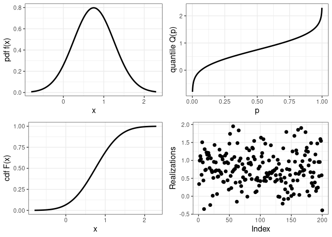
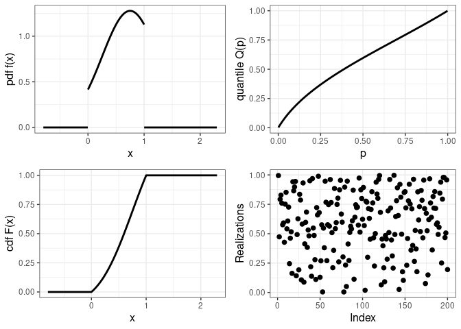
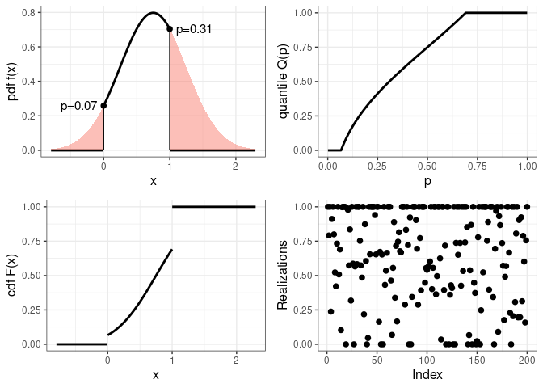
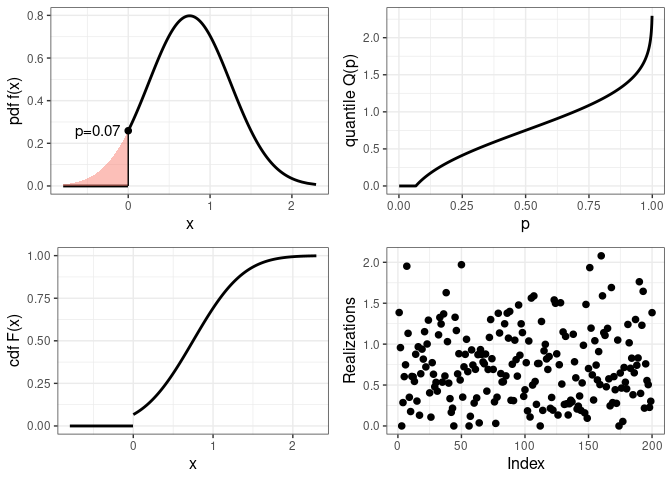
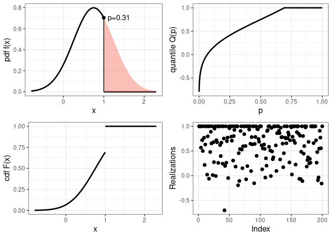
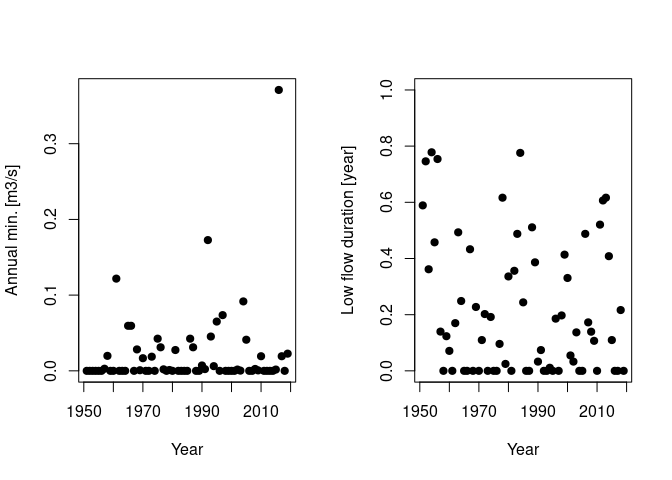
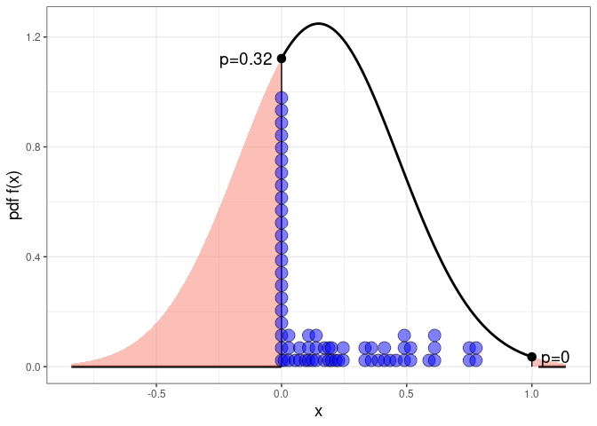
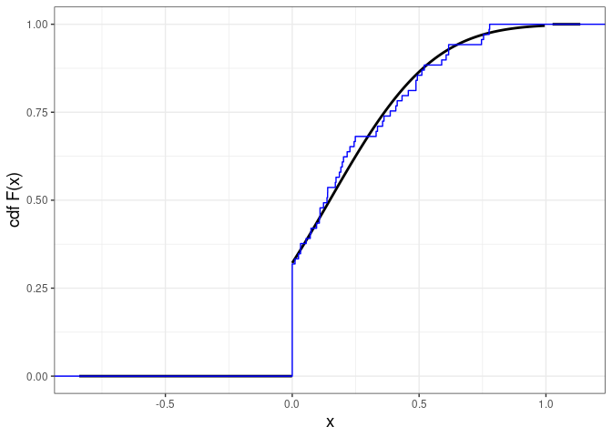
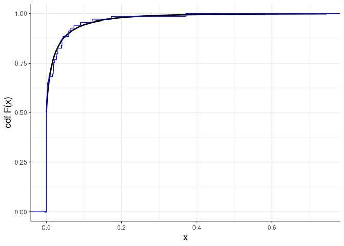
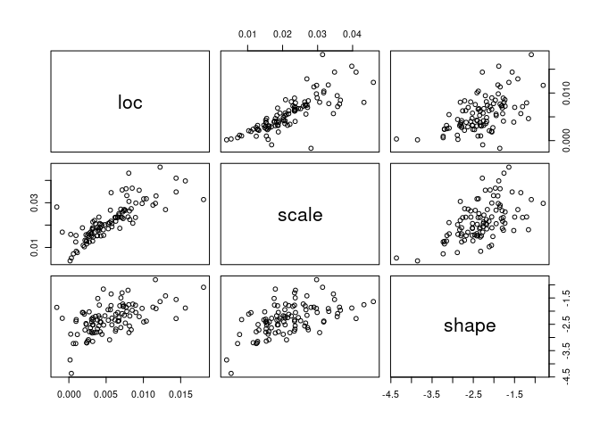

The disTRIMbution package
================

# Introduction

Many datasets include variables that are naturally bounded. For
instance, precipitation and streamflow have a lower bound of zero;
proportions are between zero and one; cloud cover is historically
measured in [okta](https://en.wikipedia.org/wiki/Okta), an integer
between 0 and 8; etc.

Several options exist to estimate the distribution of such data. The
first one is to transform them so that the transformed data become
unbounded. For instance, a logarithm transformation is often used for
strictly positive data; however this cannot be applied when data can
take zero values (e.g. precipitation and streamflow). An alternative
option is to leave the data as is but to use a bounded distribution that
will respect the natural bounds of the data.

This package focuses on this second approach and provides tools to build
bounded distribution by **trimming** standard distributions such as the
normal, lognormal, beta, etc. Trimming can be made in two disctinct
ways:

1.  [**Truncating**](https://en.wikipedia.org/wiki/Truncated_distribution),
    which assigns a zero probability to the bounds and is hence adapted
    to variables having *unreachable*
    bounds.
2.  [**Rectifying**](https://en.wikipedia.org/wiki/Rectified_Gaussian_distribution),
    which assigns non-zero probabilities to the bounds and is hence
    adapted to variables having *reachable* bounds.

This vignette starts by describing the basic tools of the package
disTRIMbution and then illustrates its application to a hydrologic
dataset. The package is built on top of the
[distributions3](https://alexpghayes.github.io/distributions3/) package,
which will be systematically loaded along with disTRIMbution.

``` r
library(disTRIMbution)
```

    ## Loading required package: distributions3

    ## 
    ## Attaching package: 'distributions3'

    ## The following objects are masked from 'package:stats':
    ## 
    ##     Gamma, quantile

    ## The following object is masked from 'package:grDevices':
    ## 
    ##     pdf

# Basic usage

Before moving to trimmed distributions, let’s start by recalling how the
package distributions3 can be used to first define a distribution
object, and then to evaluate its pdf / cdf / quantile functions, or to
generate data from it (for more details, please see the
[distributions3’s
website](https://alexpghayes.github.io/distributions3/))

``` r
D <- Normal(mu=0.75,sigma=0.5) # defines a distribution object

pdf(D,-0.1) # evaluates the pdf of a N(0.75;0.5) at -0.1
cdf(D,0.75) # evaluates the cdf of a N(0.75;0.5) at 0.75
quantile(D,0.99) # evaluates the 0.99-quantile from a N(0.75;0.5)
set.seed(1);random(D,5) # generate 5 values from a N(0.75;0.5)
```

    ## [1] 0.1880982
    ## [1] 0.5
    ## [1] 1.913174
    ## [1] 0.4367731 0.8418217 0.3321857 1.5476404 0.9147539

The easiest way to understand how trimming works is to compare these
four basic functions (`pdf`, `cdf`, `quantile` and `random`) for the
untrimmed distribution, and its rectified / truncated versions. The
package disTRIMbution provides a function `plot_trim` for this very
purpose. Let’s start by the untrimmed version (which is the default):

``` r
plot_trim(D) # Plot a N(0.75;0.5) distribution
```

<!-- -->

Let’s now trim this distribution by **truncation** between zero and one.
The figure below shows that truncation simply ‘removes’ all values that
are outside the bounds; also note that the pdf values are rescaled
compared to the figure above, to makes sure that it still integrates to
one
:

``` r
plot_trim(D,trim=c(0,1),doTrunc=TRUE) # Plot a N(0.75;0.5) TRUNCATED between 0 and 1
```

<!-- -->

Let’s now trim the distribution by **rectification** between zero and
one (doTrunc=FALSE, which is the default option). Instead of ‘removing’
all values that are outside the bounds, rectification rather ‘stacks’
them on the bounds, thus leading to non-zero probabilities for the
random variable to be equal to the bounds. These probabilities
correspond to the colored areas below the pdf, and can be computed using
the cdf of the parent distribution as shown below the figure.

``` r
plot_trim(D,trim=c(0,1)) # Plot a N(0.75;0.5) RECTIFIED between 0 and 1
```

<!-- -->

``` r
cdf(D,0) # left-side probability (of reaching the lower bound)
1-cdf(D,1) # right-side probability (of reaching the upper bound)
```

    ## [1] 0.0668072
    ## [1] 0.3085375

The package disTRIMbution provides the functions `pdf_trim`, `cdf_trim`,
`quantile_trim` and `random_trim` to compute the numbers behind these
plots, as illustrated below.

``` r
pdf(D,c(-0.1,0.75,2)) # uses the distributions3 function
pdf_trim(D,c(-0.1,0.75,2)) # same result as above since no trimming by default
pdf_trim(D,c(-0.1,0.75,2),trim=c(0,1)) # rectification
pdf_trim(D,c(-0.1,0.75,2),trim=c(0,1),doTrunc=TRUE) # truncation
```

    ## [1] 0.1880982 0.7978846 0.0350566
    ## [1] 0.1880982 0.7978846 0.0350566
    ## [1] 0.0000000 0.7978846 0.0000000
    ## [1] 0.00000 1.27732 0.00000

``` r
cdf(D,c(-0.1,0.75,2)) # uses the distributions3 function
cdf_trim(D,c(-0.1,0.75,2)) # same result as above since no trimming by default
cdf_trim(D,c(-0.1,0.75,2),trim=c(0,1)) # rectification
cdf_trim(D,c(-0.1,0.75,2),trim=c(0,1),doTrunc=TRUE) # truncation
```

    ## [1] 0.04456546 0.50000000 0.99379033
    ## [1] 0.04456546 0.50000000 0.99379033
    ## [1] 0.0 0.5 1.0
    ## [1] 0.000000 0.693491 1.000000

``` r
quantile(D,c(0.05,0.5,0.95)) # uses the distributions3 function
quantile_trim(D,c(0.05,0.5,0.95)) # same result as above since no trimming by default
quantile_trim(D,c(0.05,0.5,0.95),trim=c(0,1)) # rectification
quantile_trim(D,c(0.05,0.5,0.95),trim=c(0,1),doTrunc=TRUE) # truncation
```

    ## [1] -0.07242681  0.75000000  1.57242681
    ## [1] -0.07242681  0.75000000  1.57242681
    ## [1] 0.00 0.75 1.00
    ## [1] 0.1035995 0.5961231 0.9565450

``` r
set.seed(1);random(D,5) # uses the distributions3 function
set.seed(1);random_trim(D,5) # same result as above since no trimming by default
set.seed(1);random_trim(D,5,trim=c(0,1)) # rectification
set.seed(1);random_trim(D,5,trim=c(0,1),doTrunc=TRUE) # truncation
```

    ## [1] 0.4367731 0.8418217 0.3321857 1.5476404 0.9147539
    ## [1] 0.4367731 0.8418217 0.3321857 1.5476404 0.9147539
    ## [1] 0.4367731 0.8418217 0.3321857 1.0000000 0.9147539
    ## [1] 0.3849403 0.4867297 0.6549853 0.9213979 0.3161675

Finally, note that infinity values `-Inf` and `Inf` can be used to trim
on one side only:

``` r
plot_trim(D,trim=c(0,Inf)) # Plot a N(0.75;0.5) rectified below 0 
```

<!-- -->

``` r
plot_trim(D,trim=c(-Inf,1)) # Plot a N(0.75;0.5) rectified above 1 
```

<!-- -->

# Fitting a trimmed distribution to data

The package disTRIMbution also provides tools for estimating trimmed
distributions. This is illustrated here using a dataset describing low
flows in the [Cowhouse Creek
river](https://waterdata.usgs.gov/nwis/inventory/?site_no=08101000&agency_cd=USGS),
Texas, USA. The data frame `CowhouseCreek` contains 3 columns: the year
in 1951-2019, the annual minimum streamflow (in \(m^3.s^{-1}\)) and the
annual duration below a low-flow threshold of 0.01 \(m^3.s^{-1}\) (in
year).

``` r
CowhouseCreek[31:40,] # Show a 10-year extract  
```

    ##    year    min   duration
    ## 31 1981 0.0275 0.00000000
    ## 32 1982 0.0000 0.35616438
    ## 33 1983 0.0000 0.48767123
    ## 34 1984 0.0000 0.77595628
    ## 35 1985 0.0000 0.24383562
    ## 36 1986 0.0425 0.00000000
    ## 37 1987 0.0311 0.00000000
    ## 38 1988 0.0000 0.51092896
    ## 39 1989 0.0000 0.38630137
    ## 40 1990 0.0071 0.03287671

Both variables in this dataset are bounded. The annual minimum
streamflow is bounded from below by zero, and this value is reached
quite frequently since the river is intermittent. The annual low flow
duration is necessarily between zero and one when expressed in year. The
value zero is reached fairly regularly; the value one has never been
reached yet, however several high values around 0.8 suggest that this
may well end up happening. It therefore makes sense to consider a
rectified distribution for both variables.

``` r
par(mfrow=c(1,2)) # plot both variables side by side  
plot(CowhouseCreek$year,CowhouseCreek$min,pch=19,xlab='Year',ylab='Annual min. [m3/s]')
plot(CowhouseCreek$year,CowhouseCreek$duration,pch=19,xlab='Year',ylab='Low flow duration [year]',ylim=c(0,1))
```

<!-- -->

We start with the variable ‘duration’ and use a normal distribution
rectified between zero and one. The latter can be estimated (using the
maximum likelihood approach) with the function `estim_ML` as shown
below.

``` r
# Start by specifying the assumed distribution with 'first guess' parameters (D0)
D0 <- Normal(mu=0.05,sigma=0.1)
# Estimate parameters and return the estimated distribution D 
D <- estim_ML(d=D0,y=CowhouseCreek$duration,trim=c(0,1))
D
```

    ## Normal distribution (mu = 0.147988550223818, sigma = 0.319525174380106)

The goodness-of-fit of the estimated distribution D to the data can be
evaluated by comparing, for instance, the estimated pdf with the raw
data. The function `plot_trim_pdf` can be used to plot the estimated
pdf. Since it returns a ggplot object, a layer representing the raw data
can easily be added as shown below.

``` r
library(ggplot2)
g <- plot_trim_pdf(D,trim=c(0,1)) # estimated pdf
g+geom_dotplot(data=CowhouseCreek,aes(x=duration),binwidth = 0.01,dotsize=5,alpha=0.5,fill='blue')  # add layer for observations
```

<!-- -->

An alternative and arguably easier-to-interpret comparison can be made
by using the cdf rather than the pdf. The resulting figure suggests that
the fit seems acceptable.

``` r
g <- plot_trim_cdf(D,trim=c(0,1)) # estimated cdf
g+stat_ecdf(data=CowhouseCreek,aes(duration),color='blue')  # add layer for observations
```

<!-- -->

Remind that the value 1 has never been observed so far, meaning that the
streamflow never spent the whole year below the low flow threshold. But
what is the probability of this happening? This can be evaluated by
using the estimated distribution as shown below. The result suggests a
probability of around 0.4% - rather low but not impossible\!

``` r
1-cdf(D,1)  # 'right-side probability' of reaching 1
```

    ## [1] 0.003832367

We now turn our attention to the variable ‘min’, and we are going to try
a non-normal distribution for this variable. The list of available
distributions include all those available in the package distributions3
(see
[here](https://alexpghayes.github.io/distributions3/reference/index.html))
plus a few additional ones provided by disTRIMbution (type
`help(package="disTRIMbution")`). Here we use the distribution `GEVmin`,
which is a natural candidate for such annual minimum values (see
[here](https://en.wikipedia.org/wiki/Generalized_extreme_value_distribution#Modification_for_minima_rather_than_maxima)).

``` r
# Start by specifying the assumed distribution with 'first guess' parameters (D0)
D0 <- GEVmin(loc=0.1,scale=0.1,shape=-0.5)
# Estimate parameters and return the estimated distribution D 
D <- estim_ML(d=D0,y=CowhouseCreek$min,trim=c(0,Inf))
D
```

    ## GEVmin distribution (loc = 0.00540743204446482, scale = 0.0218654254451523, shape = -2.24676225644878)

As previously, comparison between the estimated and empirical cdf
suggests an acceptable fit.

``` r
g <- plot_trim_cdf(D,trim=c(0,Inf)) # estimated cdf
g+stat_ecdf(data=CowhouseCreek,aes(min),color='blue') # add layer for observations
```

<!-- -->

Finally, note that the function `PBoot` allows quantifying the
uncertainty in parameter estimates by means of a [parametric
bootstrap](https://en.wikipedia.org/wiki/Bootstrapping_\(statistics\)#Parametric_bootstrap)
resampling approach.

``` r
# perform 100 bootstrap replicates (at least 1000 would be better)
boot <- PBoot(d=D,n=length(CowhouseCreek$min),nsim=100,trim=c(0,Inf)) 
# scatterplot of estimated parameters
plot(boot) 
```

<!-- -->
